### 一、 设计目的 

#### 1.1功能与要求

多人语音聊天室项目由为C/S架构，分为客户端和服务端，具体需求如下。

**账号系统**

1. 支持用户注册，登录和退出。
2. 用户注册需要提供用户名和密码，用户名不可重复。

**房间**

1. 用户登录后可以创建房间，每个房间有且只有一个主持人，创建者默认为主持人，主持人可以转让给其他人。
2. 房间可以同时存在多个。
3. 房间内的用户可以听到其他用户的声音。
4. 主持人可以将若干指定用户静音，静音后所有用户不再听到被静音用户的声音，被静音用户可以主动解除静音。
5. 主持人可以将若干指定用户踢出房间。
6. 房间存在一个唯一6位数字ID，登录用户可以输入该ID加入一个房间。
7. 登录用户可以查看当前所有房间，并可选择其中一个加入。
8. 主持人退出后，房间自动解散，其他人自动退出房间。

**语音聊天**

1. 用户可以指定声音来源（包括麦克风和扬声器，可能有多个）。
2. 在正常网络下，声音每分钟明显卡顿次数小于1次，无明显延迟感。
3. 用户可以关闭房间内指定用户的声音。
4. 用户可以调节房间内指定用户的音量。

#### 1.2 环境选择

客户端的实现使用的是**Windows10**操作系统下的**QT5.12.5**, Qt是一个多平台的C++图形用户界面应用程序框架。

音频编码采用ffmpeg4.0.2的AAC方式。

服务器使用的是**ubuntu18.04**,64位版本， 带宽为1Mbps。

数据库使用的是Linux **MySQL5.7**。

### 二、客户端设计

#### 2.1总览

##### 2.1.1页面总览

总体上分为三个部分：登录注册界面、用户主界面、房间界面。

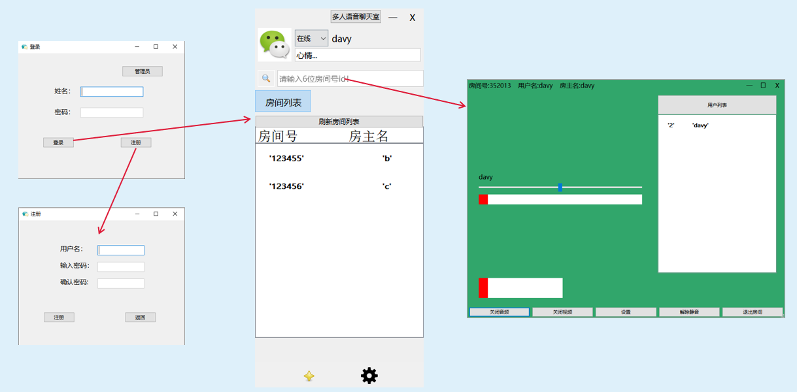

##### 2.1.2uml类图总览

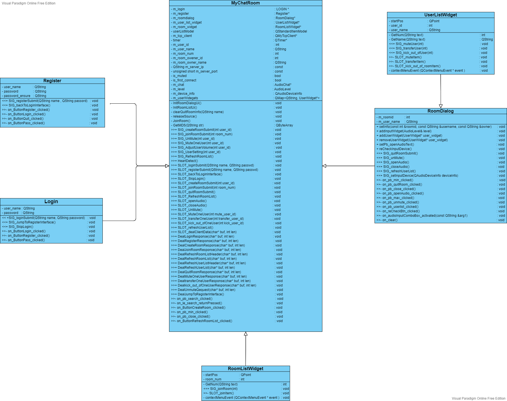

#### 2.2网络模块

对于客户端**点击事件**，考虑到需要保证可靠性，采用**tcp**协议完成传输；对于**音频数据**，采用**udp**协议保证传输效率。

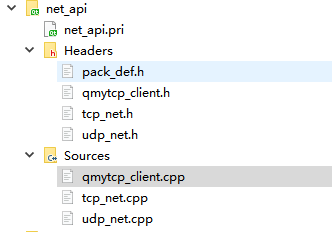

分别在tcp_net.cpp和udp_net.cpp文件中实现初始化网络、发送和接收数据等功能；在pack_def.h做了宏定义，存储一些公共变量。

定义函数：

- 网络初始化：init();
- 连接到服务器：connectToServer();
- 发送数据：sendData();
- 接受数据：recvData();
- 退出服务器：DisconnectToServer();

#### 2.3登录和注册界面

##### 2.3.1页面展示

​                                           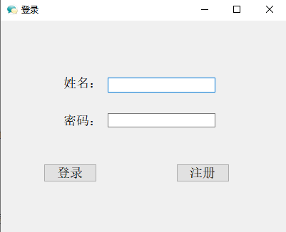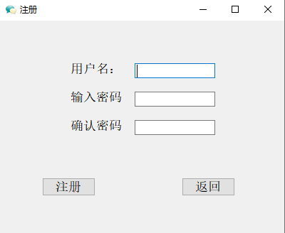

##### 2.3.2uml类图

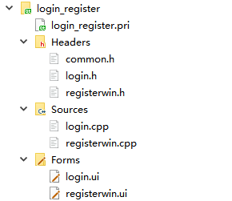

​		主要实现pushbutton按钮的**点击事件**，在槽函数中emit信号到主函数进行对应的处理。主函数将用户名和密码进行md5加密后发给后台服务器，调用数据库内容判断用户请求的合法性，并将结果返回给用户。

​                                                        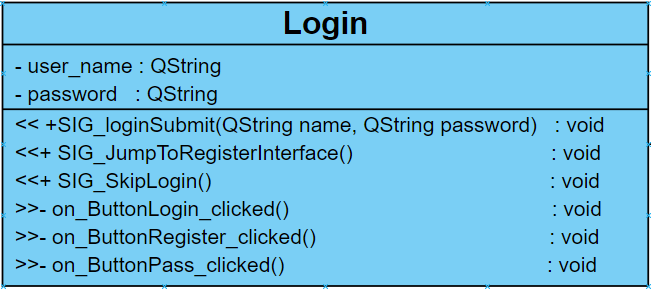

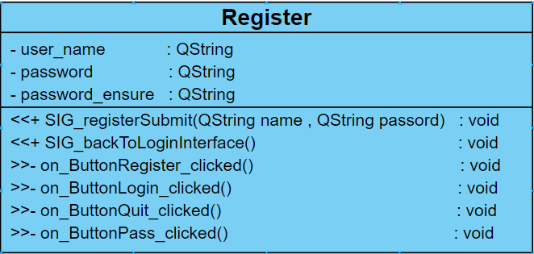

TODO:登录加密安全保证:

- 验证码防止脚本攻击
- mysql注入问题
- 记录上次登录ip，地址等进行安全提示
- 手机验证码

#### 2.4会议模块

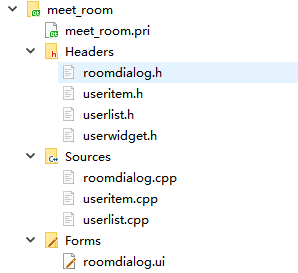

##### 2.4.1创建房间

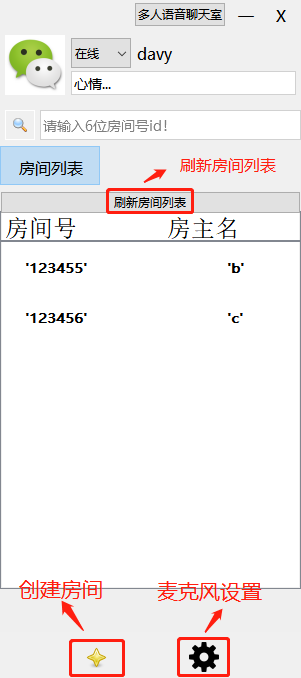

客户端单击星星图标发送信号，向服务端发送创建房间请求，服务器随机生成一个唯一的6位数房间号返回给客户端。

```
emit SIG_createRoom();
```

点击刷新房间列表按钮，服务器会更新客户端的房间列表为当前最新状态。

```
emit SIG_RefreshRoomList();
```

点击设置按钮可以对麦克风进行设置，切换自己的设备。

```
m_audio_device->show();
```

##### 2.4.2加入房间

加入房间一共提供了两种方式：

- 用户手动输入6位房间号，单击搜索按钮或按下回车键加入房间。
- 用户右键房间列表中的一个房间，点击加入房间。

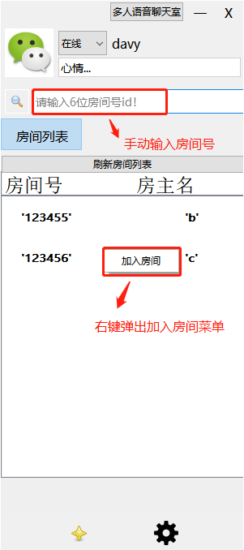

触发点击事件后，客户端向服务端发送加入房间请求，服务器将客户端添加至房间列表，并给房间的每一个客户端发送成员列表。

```
emit SIG_joinRoom(int num);
```

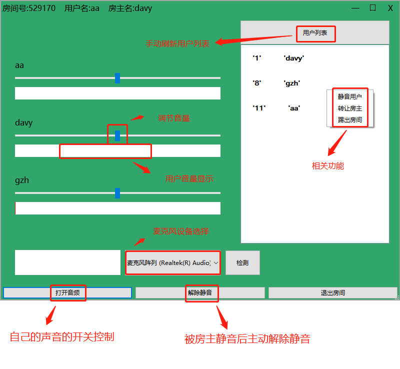

​		进入房间页面后，左侧可以显示当前用户的音量并进行调节，右侧显示当前房间的用户列表。对用户列表中的用户右键可以完成静音用户、转让房主、踢出房间等功能。下方的3个按钮完成自身声音的开闭控制、解除静音、退出房间等功能。

##### 2.4.3退出房间

​		客户端单击右上角的x或者单击退出房间按钮时发送信号。服务器收到某客户端退出房间的请求后，查找房间，得到用户列表,向每一个客户端发送客户端退出房间提示，每一个客户端接受数据后删除退出的用户的相关资源。

```c++
SIG_quitRoom();//客户端向服务器发出退出信号
SLOT_clientQuit();//服务器向客户端发出某个客户端退出信号，在槽函数中处理。
```

#### 2.4音频模块

##### 2.4.1基本流程和概念

对于音频，需要采集电脑麦克风声音，采用QAudioInput和QAudioOutput模块完成。

音频方面需要**编码后再传输**，编码选择 **ffmpeg** 进行处理。音频的主要流程：


##### 2.4.2语音采集

​		语音采集指的是从麦克风采集音频数据，即声音样本转换成数字信号。

​		

​		这里使用qt自带的QAudioInput类采集语音，该模块每**40ms**发出**QIODevice::readyRead()**，通知外部模块读取数据。支持多种音频格式：
|      |      |
| ---- | ---- |
|supportedSampleRates:      | 8000, 11025, 16000, 22050, 32000, **44100**, 48000, 88200, 96000, 192000 |
|supportedChannelCounts:    | 1, **2**, 3, 4, 5, 6, 7, 8, 9, 10, 11, 12, 13, 14, 15, 16, 17, 18 |
|supportedSampleSizes:      | 8, **16**, 24, 32, 48, 64 |
|supportedSampleTypes:      | **SignedInt**, UnSignedInt, Float |
|supportedByteOrders:       | **LittleEndian** |
|supportedCodecs:           | **"audio/pcm"** |

以上加粗的即为我们采用的参数，简单计算可以得出，每收到一次**readyRead()**可以采集到 44100 * 0.04 * 16 * 2 / 8 = **7056** 字节的数据，**每秒**产生 7056*(1/0.04)=**176400字节**，即176400 / 1024 = **172.265625Kb**。

##### 2.4.3编/解码

​		由于每秒的声音数据达到了172.2Kb之多，而服务器带宽只有1Mbps，即256Kb/s，所以对音频做编码压缩是非常必要的。

###### ffmpeg

​		FFmpeg是一套可以用来记录、转换数字音频、视频，并能将其转化为流的开源计算机程序。

###### AAC

​		AAC，全称Advanced Audio Coding，是一种专为声音数据设计的文件压缩格式。与MP3不同，它采用了全新的算法进行编码，更加高效，具有更高的“性价比”。利用AAC格式，可使人感觉声音质量没有明显降低的前提下，更加小巧。

​		经过ffmpeg将pcm音频数据编码后，其数据量可压缩至原来的1/20，

其数据格式如下：


​		多流场景下AAC解码器不能共用的问题：


##### 2.4.4声音合成


###### 音量问题

​		平时表示声音强度我们都是用**分贝（db）**作单位的，声学领域中，分贝的定义是声源功率与基准声功率比值的**对数**乘以10的数值。根据人耳的心理声学模型，人耳对声音感知程度是对数关系，而不是线性关系。

​		如下图，横轴表示音量调节滑块，纵坐标表示人耳感知到的音量，图中取了两块横轴变化相同的区域，音量滑块滑动变化一样，
但是人耳感觉到的音量变化是不一样的，在左侧也就是较安静的地方，感觉到音量变化大，在右侧声音较大区域人耳感觉到的音量变化较小。


​		所以加权平均的时候权值的变化应该与滑块成指数关系，滑块的取值范围为[0, 200)，默认值为100，我们希望滑块到0的时候音量是0，滑块为100的时候音量为100，滑块为200时音量为1000，且呈指数增长。经过计算，函数可设计为：

~~~c++
double f(int x) {
    return (pow(1.0223, x)-1) * (100/8.07478);
}
~~~


###### 对齐问题

​		多个用户的音频帧有可能长度不同


##### 2.4.5声音播放

​		使用QAudioOutput模块从合成器中获取数据write进声卡


##### 2.4.6类图：


​        编码可以极大的减小带宽。目前有很多常用的语音编码技术，像 **G.729、G.711、.iLBC、AAC、SPEEX** 等等。

​        当一个音频帧完成编码后，即可通过网络发送给通话的对方。语音对话对于低延迟和平稳性要求较高，这就要求我们的**网络传送非常顺畅**。

​       当对方接收到编码帧后，会对其进行**解码**，以恢复成为可供声卡直接播放的数据。完成解码后，即可将得到的音频帧提交给声卡进行播放。

此外，还需要考虑一些问题：**回音消除、降噪、抑制声音断断续续、静音检测、混音**等。

- 低延迟
  - 主要取决于网络波动和双方的物理位置的距离，就单纯软件的角度，优化的可能性很小。
- 回音消除：
  - 扬声器播放时，电脑外部声音被麦克风再次采集，造成回音。 回音消除的原理简单地来说就是，回音消除模块依据刚播放的音频帧，在采集的音频帧中做一些**类似抵消的运算**，从而将回声从采集帧中清除掉。现在做的比较好的回音消除有：**webrtc。**
- 噪声抑制：
  - 噪声抑制又称为降噪处理，是根据语音数据的特点，将属于背景噪音的部分识别出来，并从音频帧中过滤掉。有很多**编码器都内置**了该功能。
- 抖动缓冲区：
  - 抖动缓冲区（JitterBuffer）用于**解决网络抖动**的问题。所谓网络抖动，就是**网络延迟一会大一会小**， 在这种情况下，即使发送方是定时发送数据包的接收方很难保证定时接收，导致听到的声音就是一卡一卡的。 JitterBuffer 工作于解码器之后，语音播放之前的环节。即语音解码完成后，将解码帧放入 JitterBuffer，声卡的播放回调到来时，从 JitterBuffer 中取出最老的一帧进行播放。**JitterBuffer 是利用了较高的延迟来换取声音的流畅播放的**，因为可以调节缓冲深度来平衡网络延迟。
- 静音检测：
  -  静音检测通常也**集成在编码模块**中。**如果没有语音输入，可以在编码头部设置特殊字符来表示**。
- 混音：
  - 在视频会议中，多人同时发言时，我们需要同时播放来自于多个人的语音数据，**而声卡播放的缓冲区只有一个，所以，需要将多路语音混合成一路**。

##### 2.4.2带宽计算

以较优异的音质效果计算，采样率48KHz，采样位数16bit，双声道计算无损无压缩格式位1536kbps。考虑采用ffmpeg对音频进行压缩，大概能压缩到128kbps左右。

##### 2.4.3音频采集

逻辑：

- 客户端接收(read)到电脑内部的声音，利用定时器每隔50ms发送(write)缓冲区的数据给服务端；`readDataAndProcess()`
- 客户端接收(read)到服务端发来数据，进行处理播放。`SLOT_PlayAudio()`
- 服务端接收(read)到客户端发来的数据，处理后发送(write)给每一个客户端。

调用QAudioInput库进行音频采集，QIODevice创建缓冲区数据保存。调用QTimer创建定时器，每50ms从缓冲区采集一次数据，进行优化处理（编码、回音消除、降噪等）后发送信号SIG_AudioDataReady给主函数，主函数定义槽SLOT_sendAudioData向服务端发送数据。

主函数dealAudioData接收音频数据。

TODO：

静音检测。需要实现音频采集暂停函数，采集重写开始函数等。

```c++
//利用定时器，每隔50ms触发事件，执行readDataAndProcess函数。
connect(timer, &QTimer::timeout, this, &Audio_Read::readDataAndProcess);
//读取数据到缓冲区，并进行降噪、编码等处理。
readDataAndProcess();
//处理完毕后emit处理完毕信号
SIG_AudioDataReady(QByteArray);
//主函数中槽函数，用来发送缓冲区的数据给服务端
SLOT_sendAudioData();
//为主函数提供接口，将接收到的音频数据进行解压，混音等操作，调用QIODevice的write函数播放声音。
SLOT_PlayAudio();
```

编解码采用aac的方式完成。

#### 2.5数据传输格式

- 对于点击事件，将每个事件的数据封装为结构体，通过宏定义的消息头来区分不同类型的事件。服务端和客户端同步结构体类型，服务端接收后根据头部字段再分情况进行处理。

​                                                                    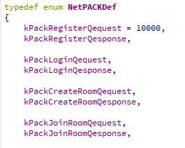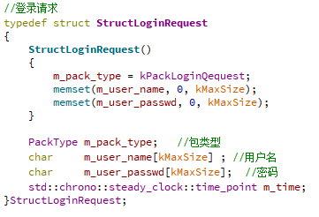

- 对于音频数据，采用下图的格式进行数据传输。
  - 
- TODO：采用json格式进行序列化。

#### 2.6客户端主函数

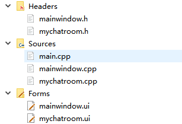

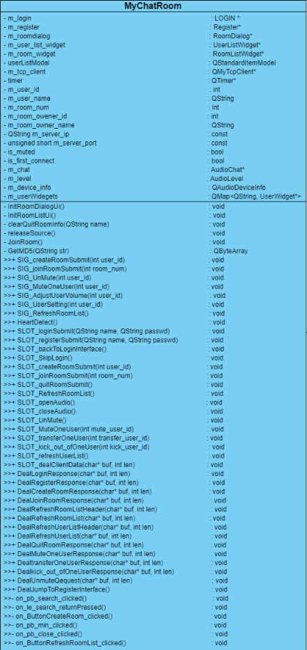

客户端主函数设立多个槽函数，用来接收登录、注册、加入房间、退出房间信号，分别槽函数中将数据发送给服务端。

设立信号SIG_readData(),设立槽函数SLOT_dealClientData()封装上述槽，一旦客户端收到服务端返回的数据，如用户声音、踢人、静音用户等，跳转到对应的槽函数中进行处理。

下面是主函数的一些信号和槽函数以及对服务端返回的数据做处理的相关函数。

```c++
signals:
    void SIG_createRoomSubmit(int user_id);         //创建房间信号

    void SIG_joinRoomSubmit(int room_num);           //加入房间信号

    void SIG_UnMute(int user_id);                    //用户向服务端发出解除静音信号信号

    void SIG_MuteOneUser(int user_id);               //关闭房间内指定用户的声音信号

    void SIG_AdjustUserVolume(int user_id);          //调节房间内指定用户的音量

    void SIG_UserSetting(int user_id);               //房间内进行用户界面设置

    void SIG_RefreshRoomList();                     //刷新房间列表

public slots:
    void HeartDetect();                                 //心跳检测槽函数

    void SLOT_loginSubmit(QString name, QString passwd); //登录槽函数，发送用户名、密码给服务端验证

    void SLOT_registerSubmit(QString name, QString passwd); //注册槽函数

    void SLOT_backToLoginInterface();                       //注册页面返回登录页面

    void SLOT_SkipLogin();                             //跳过登录界面，测试用。

    void SLOT_createRoomSubmit(int user_id); //创建房间槽函数

    void SLOT_joinRoomSubmit(int room_num); //加入房间槽函数

    void SLOT_quitRoomSubmit(); //退出房间槽函数

    void SLOT_RefreshRoomList();    //刷新房间列表槽函数

    void SLOT_openAudio();      //打开声音

    void SLOT_closeAudio();     //关闭声音

    void SLOT_UnMute(); //用户自己被房主静音，解除静音。

    void SLOT_MuteOneUser(int mute_user_id); //关闭房间内指定用户的声音

    void SLOT_transferOneUser(int transfer_user_id); //转让房主

    void SLOT_kick_out_ofOneUser(int kick_user_id);  //踢人

    void SLOT_refreshUserList();        //刷新用户列表

    void SLOT_dealClientData(char* buf, int len); //客户端收到可读信号，触发SLOT_dealClientData槽函数，其中封装了下面的登录、注册等等各个槽函数。可用策略模式完成。

    void DealLoginResponse(char* buf, int len); //接收服务端的登录回复

    void DealRegisterResponse(char* buf, int len); //接收服务端的注册回复

    void DealCreateRoomResponse(char* buf, int len); //创建房间回复

    void DealJoinRoomResponse(char* buf, int len); //加入房间回复

    void DealRefreshRoomListHeader(char* buf, int len);   //更新房间列表头部字段

    void DealRefreshRoomList(char* buf, int len);   //更新房间列表

    void DealRefreshUserListHeader(char* buf, int len);   //更新用户列表头部字段

    void DealRefreshUserList(char* buf, int len);   //更新用户列表

    void DealQuitRoomResponse(char* buf, int len); //退出房间回复

    void DealMuteOneUserResponse(char* buf, int len);  //静音用户回复

    void DealtransferOneUserResponse(char* buf, int len);                 //转让房主回复

    void Dealkick_out_ofOneUserResponse(char* buf, int len);              //踢人回复

    void DealUnmuteQequest(char* buf, int len);   //静音,客户端实现

    void DealClientQuitResponse(char* buf, int len); //服务器向客户端发出某个客户端退出信号,在槽函数中处理，将客户端在线列表中的退出用户清除。

    void DealJumpToRegisterInterface();				//跳转到注册接口
```

#### 2.8心跳检测

​		用户掉线或非正常退出后，无法发送退出信号，服务端就会保留僵尸数据。因此，在客户端处开启一个定时器，每隔一定时间向服务端发送心跳包，更新自身状态。服务端开启定时器，定期查看每个用户的状态，将状态未更新的用户数据删除。

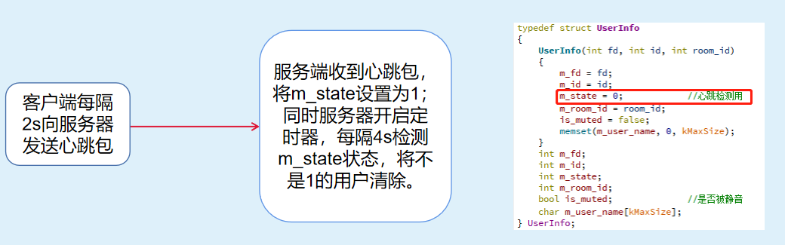

```c++
//开启定时器心跳检测
timer = new QTimer();
connect(timer, SIGNAL(timeout()), this, SLOT(HeartDetect()));
timer->start(kHeartDetectTime);
```

### 三、服务器设计

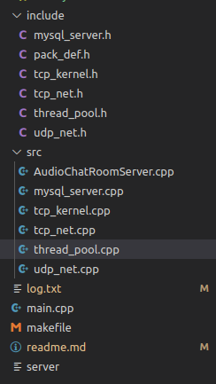

用户和服务端的请求数据交互采用tcp通信；音频数据交互采用udp通信。

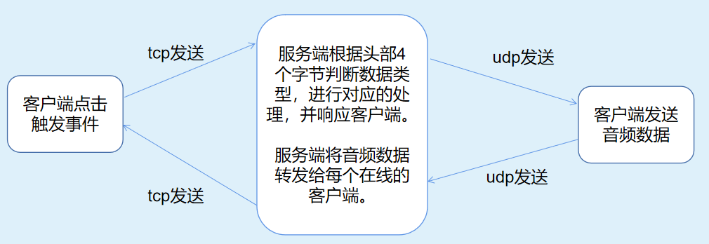

#### 1.数据库

首先创建数据库，添加**用户表**user,包含id、用户名、密码、创建时间、最后登录时间等。其中密码采用md5加密后处理，防止信息泄漏。

```mysql
create table user (
    id bigint unsigned AUTO_INCREMENT primary key,
    username varchar (30),
    passwd varchar(30),
	Createtime DATETIME,
	LastLoginTime DATETIME)ENGINE=InnoDB DEFAULT CHARSET=utf8;
```

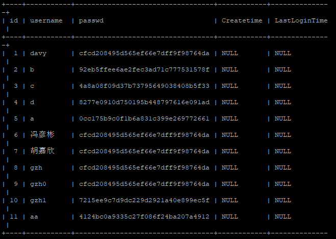

数据库用来做客户端登录和注册请求有效性的判断。

#### 2.tcp模块

**线程池：**

​		基于生产者消费者模型创建线程池，这样避免了客户连接时才创建线程，提高效率。考虑到程序属于IO密集型程序，提前创建了200个线程，其中20个核心线程，其余线程等待资源不够时才开启。利用条件变量和互斥锁的方式使得每个任务的处理之间不会发生冲突。

**基于epoll的高并发模型：**

调用epoll_wait等待客户端的连接和读写事件发生，每到来一个客户端，分配一个线程进行相关内容的处理。

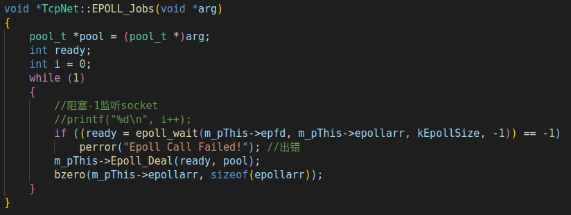

服务器收到客户端发来的数据后解析消息头，根据消息头跳转到不同的函数进行相应的处理。

```c++
int pkg_type = *(reinterpret_cast<int *>(buf)); //*(int*) 按四个字节取
```

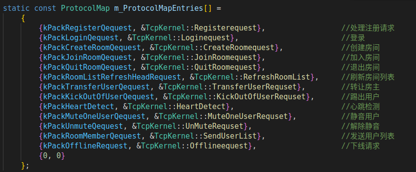

服务端维护两个map，一个用来记录用户的id和用户详细信息，一个用来记录房间号和房间内的所有用户信息。

```c++
map<int, UserInfo *> m_mapIDToUserInfo;                            //全部用户的信息,用户id和用户信息
map<int, list<UserInfo *>> m_mapRoomIDToUserList;                  //房间号和房主用户信息
```

整个服务端依靠这两个map来维护用户状态的改变。

#### 3.udp模块

执行一个简单的数据分发程序，主线程创建一个子线程，专门用来接收所有的音频数据并转发。eventloop函数完成服务器音频转发的功能。

流程如下：


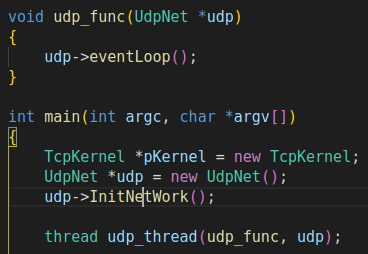

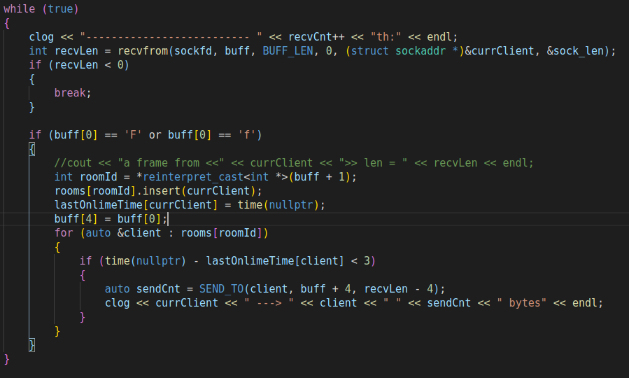


udp音频数据传输格式：

客户端 ---> 服务器


服务器 ---> 客户端


### 四、压测

​		我们的项目瓶颈目前在于带宽，都来不及测试多个用户这种点击事件是否会对cpu、内存造成影响。目前服务器支持带宽为1Mbps，实际测试支持10-12人左右在一个房间内同时说话。

​		对比现有的一些app，想了解一下他们通过什么样的方式解决的。因为服务端需要转发一个用户的音频数据给所有人，感觉这里无法优化。即使是他们机房带宽很大，按照我们这种方式也难以支持太多人同时说话。我想一个房间就用一个主机搞分布式可能太奢侈了点。

​		如何对项目进行压测，以前测试web服务器这种可以利用开源第三方工具脚本生成http请求。像这种项目的话是需要写脚本创建多个客户端，然后生成伪造的音频数据来测试吗，想知道厂商如何做到模拟多个用户测试的。


